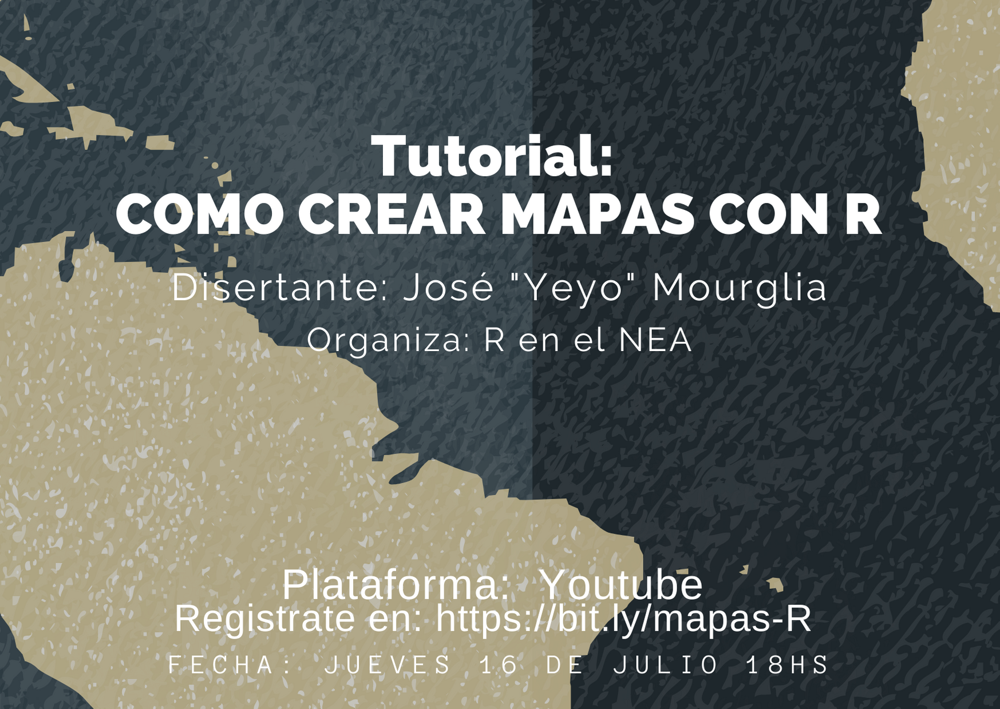
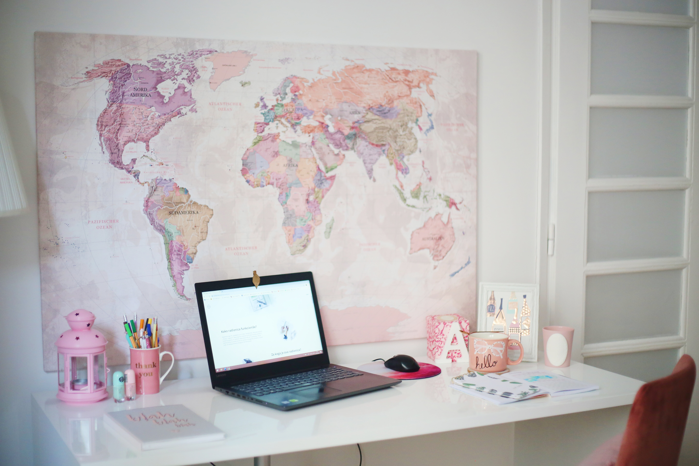
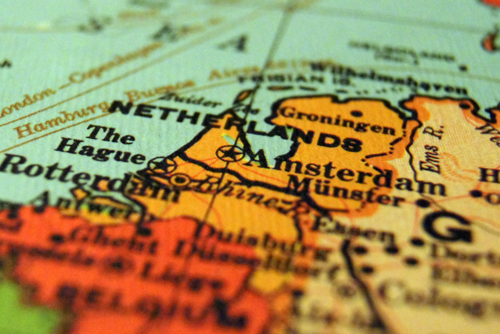
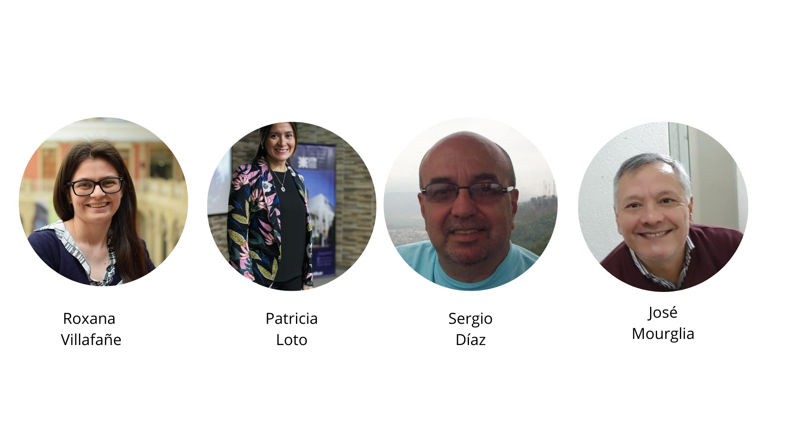

---
output:
  xaringan::moon_reader:
    lib_dir: libs
    css: xaringan-themer.css
    nature:
      highlightStyle: github
      highlightLines: true
      countIncrementalSlides: false

---
background-image: url(map.jpg)
background-size: cover
class: inverse, animated slideInRight fadeOutLeft, middle

```{r setup, include=FALSE}
options(htmltools.dir.version = FALSE)
```

```{r xaringan-themer, include=FALSE, warning=FALSE}
library(xaringanthemer)
style_duo_accent(
  primary_color = "#142a5e",
  secondary_color = "#142a5e",
  inverse_header_color = "#FFFFFF"
)
```

```{r , message=FALSE, warning=FALSE, include=FALSE} 
library(fontawesome)
library(emo)
```

```{r xaringan-logo, echo=FALSE}
xaringanExtra::use_logo("logo-r-en-el-nea.png")
```

```{r xaringan-animate-css, echo=FALSE}
xaringanExtra::use_animate_css()
```

# Creando `r emo::ji("world_map")` con `r fa("r-project", fill = 'steelblue')`

### R-en-el-NEA
### Disertante: "Yeyo" Mourglia


---
class: center, animated slideInRight fadeOutLeft

# Bienvenidxs a `r fa("r-project", fill = 'steelblue')` en el NEA  

```{r echo=FALSE, out.width = '70%'}

```


---

# Misión

* Este grupo surge con la misión de **conectar a les usuarios de R** independientemente de su grado de conocimiento sobre el software y el ámbito de aplicación del mismo. 
* Pretendemos **promover el uso del lenguaje de programación R**, apoyar el desarrollo de esta comunidad de usuaries para compartir experiencias, promover el aprendizaje continuo y favorecer la creación de proyectos interdisciplinarios. 

--

# Código de conducta

**Esperamos que R-en-el-NEA sea un grupo libre de acoso para todes.**


---

class: animated slideInRight fadeOutLeft


# Nuestras redes

###`r fa("twitter", fill = 'steelblue')` https://bit.ly/r-en-el-NEA

### `r fa("github", fill = 'black')` https://github.com/RenelNEA 

### `r fa("meetup", fill = 'red')` https://www.meetup.com/R-en-el-NEA/

#### `r emo::ji("earth_americas")` https://renelnea.github.io/web/ 

```{r echo=FALSE, out.width = '40%', fig.align='right'}

```
---
class: animated slideInRight fadeOutLeft

# Material de este Tutorial
<br>
### `r fa("github", fill = 'black')` https://bit.ly/mapas-R-NEA
<br>
### `r fa("youtube", fill = 'red')` https://bit.ly/R-nea-youtube 


```{r echo=FALSE, out.width = '30%', fig.align='right'}

```

---
class: animated slideInRight fadeOutLeft

# ¿Preguntas? `r emo::ji("writing_hand")`

Google doc compartido para escribir tus preguntas 

## https://bit.ly/mapas-R-preguntas

```{r echo=FALSE, out.width = '60%', fig.align='right'}

```

---

class: animated slideInRight fadeOutLeft

# Equipo `r emo::ji("muscle")`

```{r echo=FALSE, out.width = '100%'}

```

        
---

class: animated slideInRight fadeOutLeft

#Quien soy`r emo::ji("man_technologist")`

Soy José "Yeyo" MOURGLIA

- Informático y Estadístico recibido en la UNNE 
- Miembro de la Comunidad OpenStreetMap ARG
- Miembro de la Comunidad RSpatial_es
- Especializado en SIG/GIS
- Miembro de Grupo R-en-el-NEA

```{r echo=FALSE, out.width = '30%', fig.align='right'}
knitr::include_graphics("map3.jpg")
```


---

class: animated slideInRight fadeOutLeft

# Mis Trabajos `r emo::ji("desktop_computer")`

- Desarrolle el IDE Corrientes <https://ide.corrientes.gob.ar>
- Profesor de la UNNE-FACENA
- Profesor de Estadistica en Instituto Superior Llano
- Presentaciones en la FOSS4G (Argentina) , SOTM LATAM

```{r echo=FALSE, out.width = '50%', fig.align='right'}
knitr::include_graphics("map4.jpg")
```
---

class: animated slideInRight fadeOutLeft

# ¿Qué aprenderemos? `r emo::ji("world_map")`
 
- Haremos unos ejemplos de los paquetes `sp`, `ggplot2`, `mapview`, `tmap`
- Presentaremos con mas detalles el paquete `leaflet`
  con ejemplos de uso.


```{r echo=FALSE, out.width = '60%', fig.align='right'}

```

  
---

```{r } 
sessionInfo() 
```
---